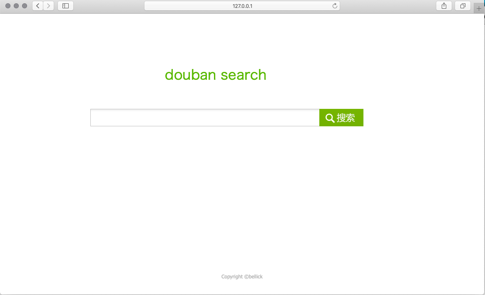

# douban-search
A search engine based on douoban. 

## 需求分析

### 功能需求

1. 实现简易web界面
2. 输入用户id  --->  他的所有帖子
3. 查询结果按时间排序（或者其他方式？）
4. 用户输入关键词  --->  包含此关键词的所有帖子
5. 模糊搜索：（先去用户ID数据库中看此关键词是不是用户ID，如果是则返回2的结果，如果不是用户ID，则返回4的结果）
6. 支持格式化搜索（类似于Google）：搜关键词（keyword：xxx），搜用户（userid：xxx）

* 查询范围：某些小组 or 全部小组 or 。。。

### 性能需求

1. 1s内响应

### 约束

1. 后台用Flask实现
2. 分布式存储方式待定（nosql?）
3. 爬虫用scrapy

## 分工

### xusy
* 爬虫
* 分布式存储

### wb

* 后台
* 界面
* 分布式存储
* 

### 界面

